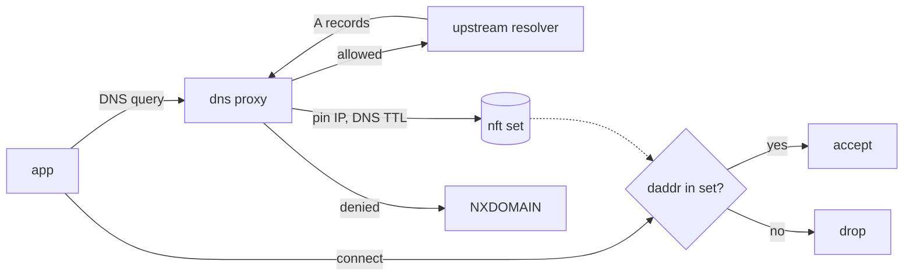

# fqdn-egress

[](https://github.com/m8-t/fqdn-egress/actions/workflows/ci.yaml)

FQDN-based egress firewall for Linux. One daemon that enforces "this machine
may only talk to these domain names" using nftables and a built-in DNS
forwarding proxy. No MITM, no proxy certificates, no per-application setup.

Typical use: locking a server, CI runner, or build box down to the handful
of domains it actually needs, so a compromised dependency or leaked token
cannot phone home.

```
# /etc/fqdn-egress/allowlist.txt
github.com
*.github.com
proxy.golang.org
registry.npmjs.org
```

## How it works

Applications resolve names through the daemon. Allowed names are forwarded
to the real resolver and the answered IPs are pinned into an nftables set
for the duration of their DNS TTL. Everything else -- unknown names, raw
IPs, other resolvers -- hits a default-drop chain.



A client that resolves elsewhere (DoH, hardcoded IPs) still cannot connect:
the verdict falls to the nftables set, and only proxy-resolved IPs are in it.
Direct port 53 to anything but the proxy is rejected.

Two modes, same engine:

- `output` -- police this machine's own outbound traffic via the output
  hook. The default and the common case.
- `forward` -- police traffic routed through this machine (VM taps,
  bridges) via the forward hook, scoped to configured interfaces.
  Optionally DNAT guest port 53 to the proxy so guests with hardcoded
  resolvers still resolve through the allowlist.

The project grew out of a microVM sandbox that needed exactly this and did
it with dnsmasq's nftset option plus a render script. fqdn-egress replaces
that combo with one static binary; see the comparison below.

## Quick start

```
go install github.com/m8-t/fqdn-egress/cmd/fqdn-egress@latest
cp contrib/example-config.yaml /etc/fqdn-egress/config.yaml   # edit: upstream, allowlist
fqdn-egress check
sudo fqdn-egress run
```

Point the system resolver at the proxy (output mode), e.g. plain
`/etc/resolv.conf`:

```
nameserver 127.0.0.1
```

or a systemd-resolved drop-in (`/etc/systemd/resolved.conf.d/fqdn-egress.conf`):

```
[Resolve]
DNS=127.0.0.1
DNSStubListener=no
```

For a permanent install use the systemd unit, see below.

## Running as a service

`contrib/fqdn-egress.service` runs the daemon without root: a dedicated
`fqdn-egress` system user plus two ambient capabilities, `CAP_NET_ADMIN`
for the nftables ruleset and `CAP_NET_BIND_SERVICE` for binding port 53.
Running non-root also gives the daemon a clean self-exemption: its own
upstream queries are accepted by source uid instead of a resolver
carve-out. The rest of the unit is standard hardening (`ProtectSystem=strict`,
syscall filter, no new privileges); `systemctl reload` sends the SIGHUP
that reloads the allowlist.

```
go build -o /usr/local/bin/fqdn-egress ./cmd/fqdn-egress
mkdir -p /etc/fqdn-egress   # config.yaml + allowlist.txt go here
cp contrib/fqdn-egress.sysusers /usr/lib/sysusers.d/fqdn-egress.conf && systemd-sysusers
cp contrib/fqdn-egress.service /etc/systemd/system/
systemctl enable --now fqdn-egress
```

Edit the allowlist, then `systemctl reload fqdn-egress` -- the ruleset and
already-pinned IPs stay in place.

### When to enable, when not to

How the service should start depends on when its listen address exists:

- **Output mode on a server or CI box** -- `listen: 127.0.0.1:53` is always
  bindable, so `systemctl enable --now fqdn-egress` and forget about it.
  This is the setup above.
- **Forward mode on an interface an orchestrator creates** (VM tap, netns
  veth): do *not* enable the unit. At boot the tap doesn't exist, the bind
  fails, and the restart loop trips systemd's start limit before the
  interface ever appears. Instead let whatever script creates the
  interface own the service lifecycle: `systemctl start fqdn-egress` after
  the interface is up, `systemctl stop` in its cleanup path (stopping also
  removes the nft table). Config: `contrib/example-config-forward-tap.yaml`.
- **Forward mode, systemd-native alternative**: bind the unit to the
  device instead of a script, then `systemctl enable` makes it follow the
  interface: start when it appears, stop when it vanishes. Drop-in with
  install notes: `contrib/example-dropin-device-bound.conf`. (Interface
  names with dashes need systemd escaping: `tap-claude` becomes
  `tap\x2dclaude`, check with `systemd-escape --suffix=device tap-claude`.)
- **Forward mode on a permanent bridge** (interface exists at boot, e.g.
  managed by systemd-networkd): plain `enable` works; the unit already
  orders itself after `network-online.target`. Config:
  `contrib/example-config-forward-bridge.yaml`.
- **Ad-hoc / testing**: skip systemd entirely, `sudo fqdn-egress run -c
  cfg.yaml -d` in a terminal. Ctrl-C tears the ruleset down. Running as
  root swaps the uid self-exemption for an automatic upstream-resolver
  carve-out, so it behaves the same.

## Configuration

One YAML file, one flat allowlist. `contrib/example-config.yaml` documents
every knob:

| key | default | |
|---|---|---|
| `mode` | `output` | `output` or `forward` |
| `listen` | `127.0.0.1:53` | proxy address; tap/bridge IP in forward mode |
| `upstream` | - | resolver queries are forwarded to |
| `allowlist` | - | path to the allowlist file |
| `interfaces` | - | forward mode: interfaces to police |
| `dns_dnat` | `false` | forward mode: redirect guest :53 to the proxy |
| `ttl.min`, `ttl.max` | `30s`, `1h` | clamp for how long resolved IPs stay pinned |
| `carveouts` | - | static CIDR(+proto+port) accepts, for IP-only destinations |
| `answer` | `nxdomain` | reply for denied names: `nxdomain` or `refuse` |
| `log_prefix` | `fqdn-egress-blocked: ` | kernel log prefix for dropped packets |
| `nflog_group` | off | log drops from the daemon instead, with domain attribution |
| `metrics_listen` | off | Prometheus endpoint address |

Allowlist: one name per line, `#` comments, `*.example.com` wildcards
(matches subdomains, not the apex). Reload with SIGHUP; pinned IPs and the
ruleset stay in place.

```
fqdn-egress run     start the daemon
fqdn-egress check   validate config and allowlist, no root needed
fqdn-egress status  show pinned IPs with remaining TTL
fqdn-egress flush   clear pinned IPs
```

Denied and dropped traffic is observable in three places: structured logs
(denied queries), dropped packets, and `/metrics` (queries by verdict,
upstream latency, pinned set size). Dropped packets go to the kernel log by
default (`journalctl -k | grep fqdn-egress-blocked`, rate-limited); with
`nflog_group` set the daemon consumes them itself and logs each drop with
the domain the destination was last resolved as:

```
level=WARN msg="egress blocked" src=172.16.0.2 dst=140.82.121.4 proto=tcp
    dport=443 resolved_as=[github.com]
```

An IP that never went through the proxy shows `resolved_as="never (direct
IP?)"` -- the tell for hardcoded-IP egress attempts. Name history is kept
for 24h, deliberately longer than any pin: attribution matters most when a
pin has already expired.

## Threat model

What it stops: egress to any destination whose name is not on the
allowlist, including direct-to-IP connections and DNS exfiltration via
alternative resolvers.

What it does not stop:

- Content-level abuse of allowed destinations. If `github.com` is allowed,
  data can be pushed to any repository on it. This is an L3/L4 control,
  not L7 inspection.
- A client resolving over DoH/DoT to an allowed host learns other IPs but
  still cannot connect to them; the control holds, but expect NXDOMAIN
  noise in its logs rather than clean failures.

IPv6 is answered empty (clients fall back to v4) and not pinned; a v6
default-drop is on the roadmap before v6 answers are.

## Compared to the dnsmasq nftset trick

dnsmasq can pin resolved IPs into an nft set (`--nftset`), which is the
same core idea and works. In practice it needs a second tool to render
`nftset=/name/...` lines from an allowlist, a hand-written companion
ruleset, and careful ordering between the two; wildcard semantics are
dnsmasq's, and there is no status/flush tooling or metrics. fqdn-egress is
that whole stack in one binary with one config file.

Heavier alternatives (Cilium DNS policies, OPNsense aliases, MITM proxies)
solve broader problems; if you just need "this box talks to these names",
they are a lot of machinery.

## Development

```
go test ./...                            # unit tests
unshare -Ur -n go test ./internal/nft/   # kernel-facing tests, unprivileged netns
sudo test/integration.sh                 # end-to-end, output mode
sudo test/integration-forward.sh         # end-to-end, forward mode + dnat
```

The integration tests build throwaway network namespaces and never send
traffic off the machine.

## License

WTFPL
